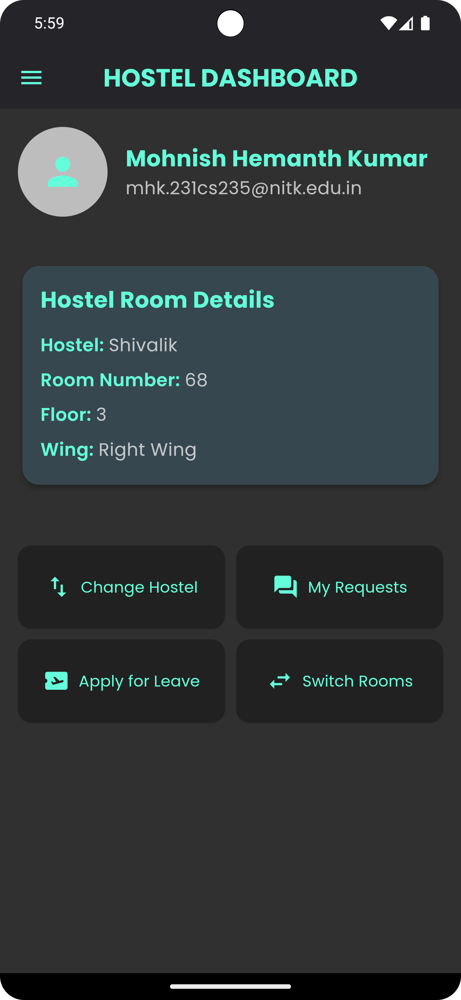
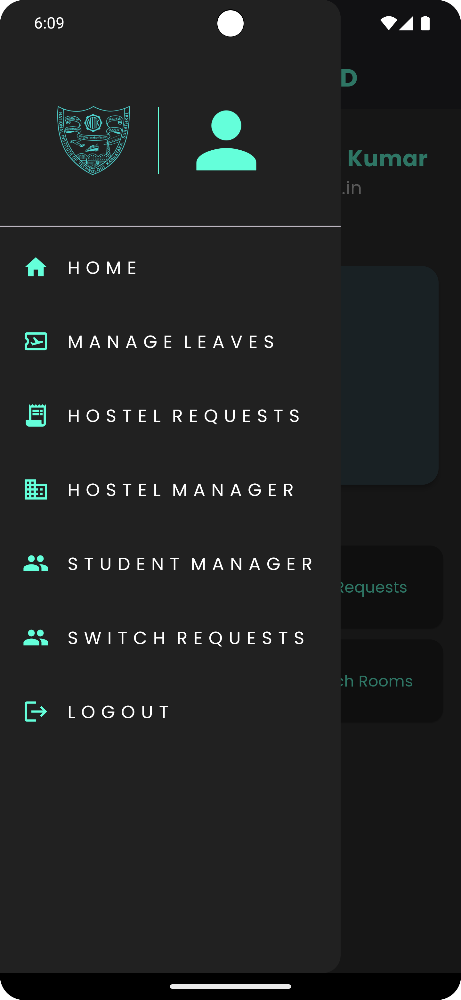

# IRIS HOSTEL MANAGER

    
    

## List of Implimented features

  * Authentication screen integrated with firebase
  * Hostel Dashboard with a drawer
  * Used Hive to store hostel information which also updates when a new hostel is added by the admin
  * Change Hostel feature.(The user can see which rooms are available)
  * My requests module to track your leave requests and hostel change requests
  * Leave Application module to apply for leave
  * Switch Rooms Feature to apply for room switch which requires consent from both the parties
  * Manage Leaves module for admin to approve/reject users leave requests
  * Hostel Requests module for admin to approve/reject users hostel change requests
  * Switch Requests module for admin to approve/reject users room switch requests
  * Hostel Manager module for admin to view all the available hostels,add new ones and  also delete hostels.
  * Student Manager module for admin to view all the students and their details, Also reallocate or deallocate users. This module also has a search feature
  * Use of Bloc for State Management
  * Implemented Role Based Access for admins and users
## List of Planned features 

* Displaying original hostel layouts while hostel booking
## Recordings
App
https://drive.google.com/file/d/1OYoBaK6j8lfa8s7Y7qr-0snmoVT8r6Qj/view?usp=drive_link
Firebase
https://drive.google.com/file/d/1BJ2OUCJEQeveRu65DYkl2YA9r2DhQhWe/view?usp=sharing
## References
* https://www.youtube.com/watch?v=THCkkQ-V1-8
* https://www.youtube.com/watch?v=Y1roIi0-Sro&list=PL9n0l8rSshSkzasAAyVMozHQu8-LdWxI0&index=2
* https://www.youtube.com/watch?v=Dh-cTQJgM-Q&t=127s
  
## Operating system 
windows
## Design Tools
Adobe After Effects
 

